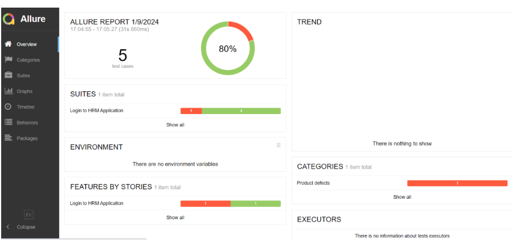

# AllureReport_Cucumber_Selenium_JUnit4

1. This framework consists of:
````
Cucumber – 7.15.0
Java 17
JUnit – 4.13.2
Allure Bom - 2.25.0
AspectJ - 1.9.21
Allure Maven - 2.12.0
Maven – 3.9.6
Selenium - 4.16.1
Maven Compiler Plugin - 3.12.1
Maven Surefire Plugin - 3.2.3

````

2. To run the tests, use the below command
````
mvn clean test
````

3. The path of allure-results folder is present in target folder, declared in allure.properties present in **src/test/resources**.</n>


4. Change the path to allure-results by using the below command
````
cd target
````

5. Create the Allure Report by using the below command
````
allure serve
````

6. Sample Allure Report Dashboard

